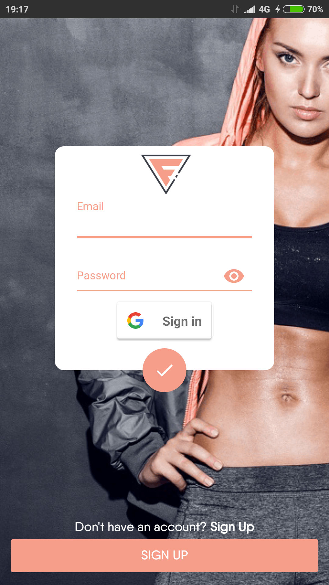
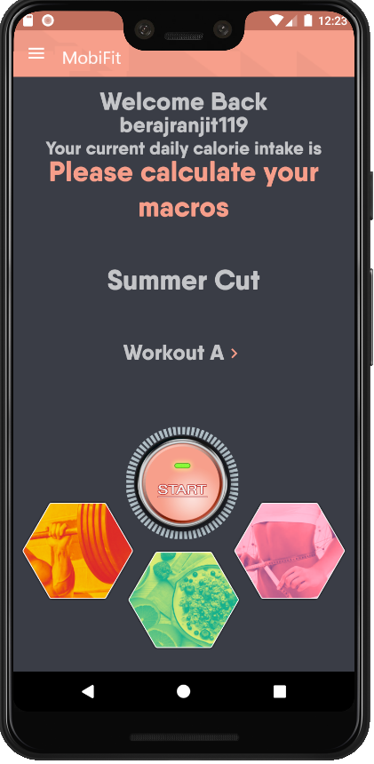
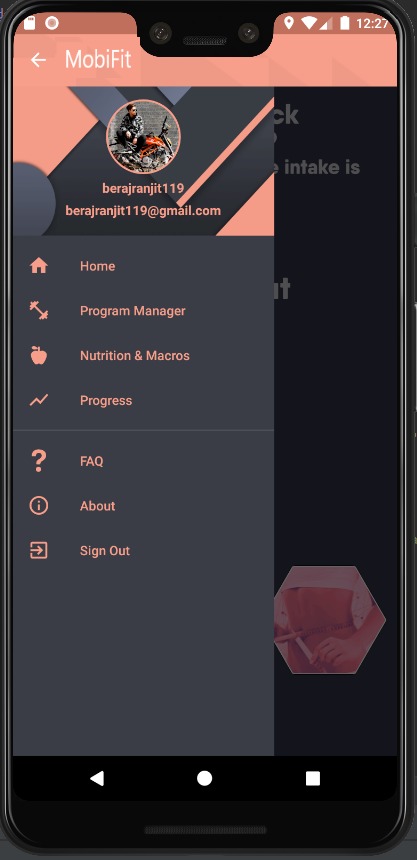
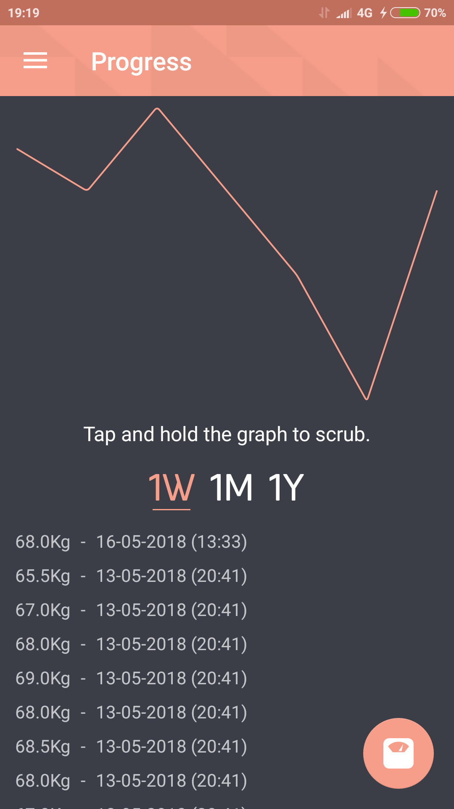
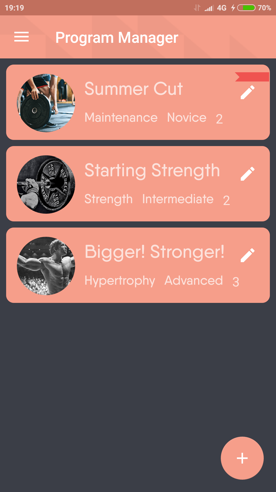
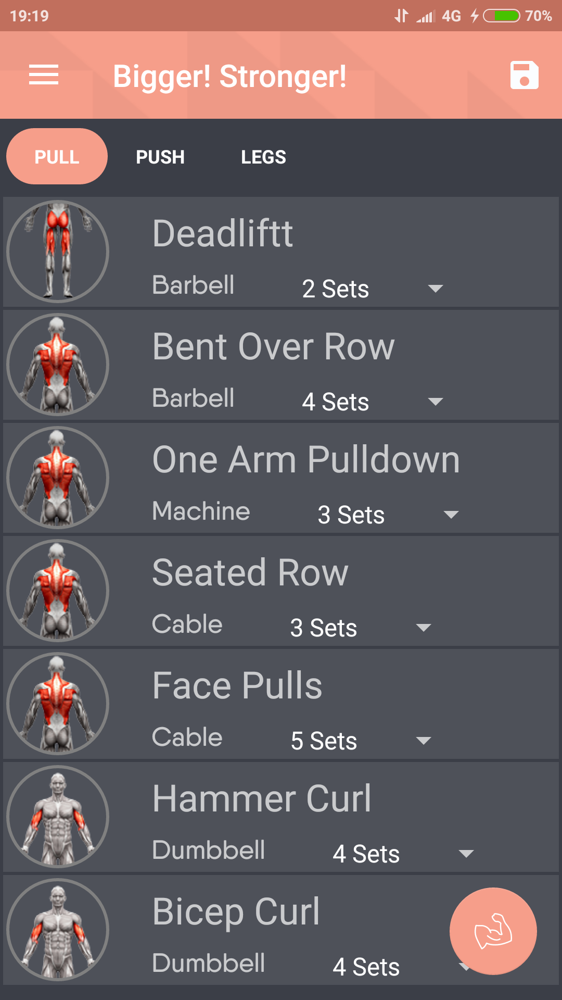
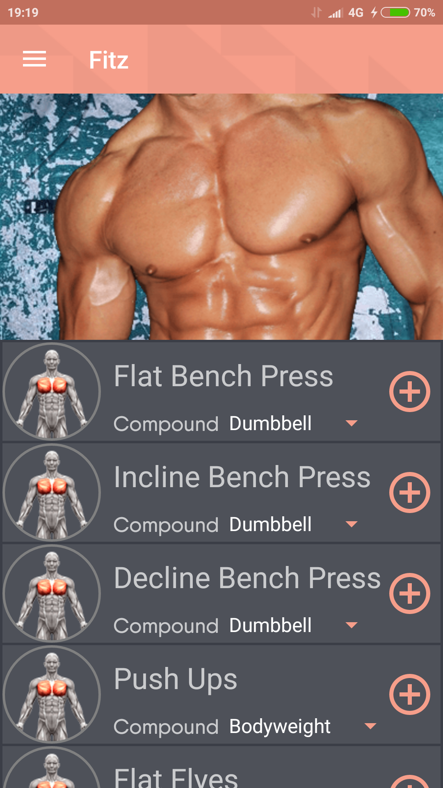
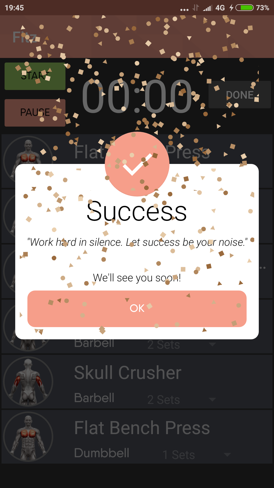

<h2 align="center"><b>Mobifit - Fitness Android App</b></h2>
<h4 align="center">An android application focused on achieving fitness and health goals in a more convenient way.</h4>

## Description

The fitness app that gets you results and turns helps you maintain a healthy lifestyle.
Build and adjust your workout routine and calorie intake on the go, no internet needed!
Contains the most effective and fresh exercises for each body part.
It's time you stop bringing your workout routine sheet to the gym and just pop into the app.

## Features

* Build and edit workout programs.
* Get a daily Macro/Calorie number to fit your goals.
* Follow your fitness and weight progress.
* Today's workout for staying on point.
* Add exercises from the database.
* Remove workouts and exercises with a swipe.
* Place exercises in the wanted position by swipe.
* Edit the sets, reps & weight for each exercise.
* Mark completed exercises.
* Supports offline.

## Screenshots

  
  
  

